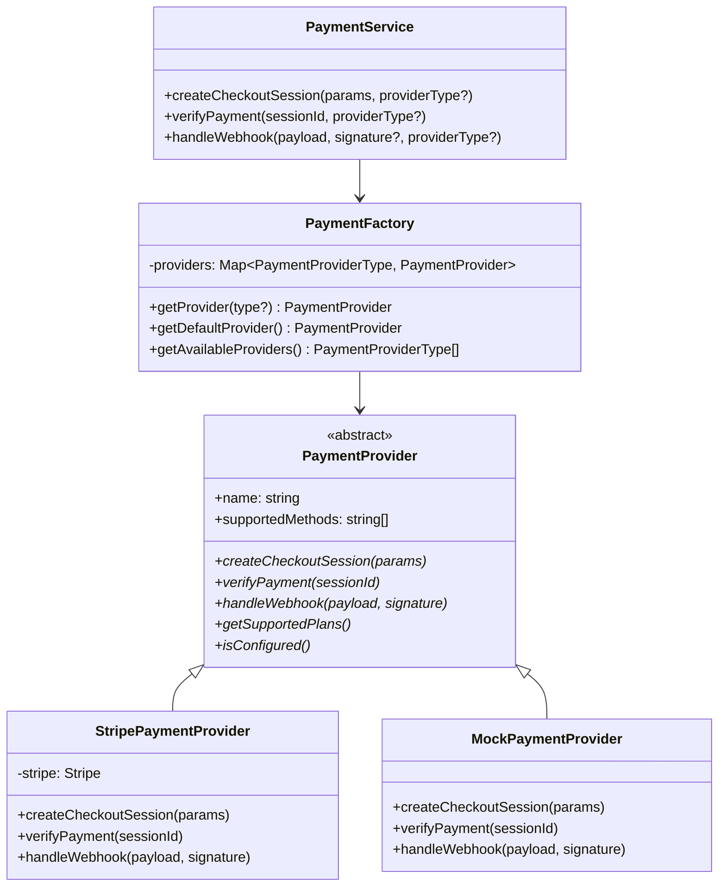

# 多支付方式系统架构重构

## 📋 概述

本文档描述了项目中支付系统从单一 Stripe 支付到多支付方式架构的重构过程。新架构支持通过配置轻松切换不同的支付提供商，并为未来扩展其他支付方式奠定了基础。

## 🎯 重构目标

- **支付方式解耦**：将支付逻辑从特定提供商中抽象出来
- **配置化切换**：通过环境变量轻松切换支付提供商
- **易于扩展**：为添加新支付方式提供标准化接口
- **向后兼容**：保持现有 Stripe 功能完整可用
- **开发友好**：提供模拟支付用于开发和测试

## 🏗️ 架构设计

### 核心组件

```
lib/payments/
├── types.ts          # 类型定义和抽象接口
├── config.ts         # 支付配置管理
├── factory.ts        # 支付提供商工厂
├── service.ts        # 统一支付服务
└── providers/
    ├── stripe.ts     # Stripe 支付实现
    ├── mock.ts       # 模拟支付实现
    └── [future].ts   # 未来的支付提供商
```

### 设计模式

1. **抽象工厂模式**：`PaymentFactory` 负责创建和管理支付提供商实例
2. **策略模式**：`PaymentProvider` 抽象类定义统一接口，不同提供商实现不同策略
3. **单例模式**：支付提供商实例被缓存，避免重复创建

## 📊 类图结构



## 🔧 核心接口

### PaymentProvider 抽象类

```typescript
export abstract class PaymentProvider {
  abstract name: string;
  abstract supportedMethods: string[];

  // 创建支付会话
  abstract createCheckoutSession(params: PaymentCreateSessionParams): Promise<PaymentSession>;

  // 验证支付
  abstract verifyPayment(sessionId: string): Promise<PaymentVerificationResult>;

  // 处理 Webhook
  abstract handleWebhook(payload: any, signature?: string): Promise<PaymentWebhookEvent | null>;

  // 获取支持的计划
  abstract getSupportedPlans(): PaymentPlan[];

  // 检查配置是否有效
  abstract isConfigured(): boolean;
}
```

### 支付计划配置

```typescript
export const PAYMENT_PLANS = {
  pro: {
    id: 'pro',
    name: 'Pro Plan',
    price: 599, // $5.99 in cents
    credits: 800,
    description: '专业版方案 - 每月800积分',
    type: 'subscription' as const,
  },
  credits_100: {
    id: 'credits_100',
    name: '100 积分包',
    price: 99,
    credits: 100,
    description: '一次性购买 100 积分',
    type: 'one_time' as const,
  },
  // ... 更多计划
};
```

## ⚙️ 配置说明

### 环境变量

```bash
# 支付系统配置
DEFAULT_PAYMENT_PROVIDER="mock"          # 默认支付提供商
ENABLED_PAYMENT_PROVIDERS="mock,stripe" # 启用的支付提供商（逗号分隔）

# Stripe 配置（可选）
STRIPE_SECRET_KEY="sk_test_..."
STRIPE_PUBLISHABLE_KEY="pk_test_..."
STRIPE_WEBHOOK_SECRET="whsec_..."
STRIPE_PRICE_ID="price_..."

# 未来的支付提供商配置
# ALIPAY_APP_ID="..."
# WECHAT_PAY_MCH_ID="..."
# PAYPAL_CLIENT_ID="..."
```

### 配置优先级

1. 如果指定了 `DEFAULT_PAYMENT_PROVIDER` 且在启用列表中，使用该提供商
2. 否则使用 `ENABLED_PAYMENT_PROVIDERS` 列表中的第一个
3. 如果配置的提供商不可用，自动回退到模拟支付

## 🚀 使用指南

### 基本用法

```javascript
// 1. 创建支付会话
const response = await fetch('/api/create-checkout-session', {
  method: 'POST',
  headers: { 'Content-Type': 'application/json' },
  body: JSON.stringify({
    planId: 'pro',
    locale: 'zh',
    paymentProvider: 'stripe' // 可选，指定支付提供商
  })
});

// 2. 验证支付
const verification = await fetch(`/api/verify-payment?session_id=${sessionId}`);

// 3. 处理 Webhook（自动路由到对应提供商）
// Webhook URL: /api/stripe/webhook 或 /api/payment/webhook
```

### 切换支付提供商

#### 使用模拟支付（开发/测试）
```bash
DEFAULT_PAYMENT_PROVIDER="mock"
ENABLED_PAYMENT_PROVIDERS="mock"
```

#### 使用 Stripe
```bash
DEFAULT_PAYMENT_PROVIDER="stripe"
ENABLED_PAYMENT_PROVIDERS="stripe,mock"
STRIPE_SECRET_KEY="your_stripe_secret_key"
STRIPE_WEBHOOK_SECRET="your_webhook_secret"
```

#### 混合模式（支持多种支付方式）
```bash
DEFAULT_PAYMENT_PROVIDER="stripe"
ENABLED_PAYMENT_PROVIDERS="stripe,mock,alipay"
```

## 🧪 模拟支付系统

### 特性

- **完整的支付流程模拟**：支持成功、失败、取消等场景
- **零成本测试**：不产生任何实际费用
- **开发友好**：提供可视化的支付测试界面
- **数据一致性**：模拟支付的数据处理与真实支付完全一致

### 模拟支付页面

路径：`/[locale]/payment/mock`

功能：
- 显示订单详情
- 模拟支付成功/失败
- 支付取消处理
- 自动跳转到结果页面

## 📁 文件变更概览

### 新增文件

```
lib/payments/
├── types.ts                 # 支付系统类型定义
├── config.ts               # 支付配置和计划管理
├── factory.ts              # 支付提供商工厂类
├── service.ts              # 统一支付服务接口
└── providers/
    ├── stripe.ts           # Stripe 支付提供商实现
    └── mock.ts             # 模拟支付提供商实现

app/[locale]/payment/
└── mock/
    └── page.tsx            # 模拟支付页面

.env.example                # 环境变量配置示例
docs/
└── payment-system-refactor.md  # 本文档
```

### 修改文件

```
app/api/create-checkout-session/route.ts  # 重构为使用 PaymentService
app/api/verify-payment/route.ts          # 重构为使用 PaymentService
lib/stripe.ts                            # 保留原有配置（向后兼容）
```

## 🔮 扩展指南

### 添加新的支付提供商

#### 1. 创建提供商实现

```typescript
// lib/payments/providers/alipay.ts
export class AlipayPaymentProvider extends PaymentProvider {
  name = 'alipay';
  supportedMethods = ['alipay'];

  isConfigured(): boolean {
    return !!(process.env.ALIPAY_APP_ID && process.env.ALIPAY_PRIVATE_KEY);
  }

  async createCheckoutSession(params: PaymentCreateSessionParams): Promise<PaymentSession> {
    // 实现支付宝支付会话创建
  }

  async verifyPayment(sessionId: string): Promise<PaymentVerificationResult> {
    // 实现支付宝支付验证
  }

  async handleWebhook(payload: any, signature?: string): Promise<PaymentWebhookEvent | null> {
    // 实现支付宝 Webhook 处理
  }

  getSupportedPlans(): PaymentPlan[] {
    return Object.values(PAYMENT_PLANS);
  }
}
```

#### 2. 注册到工厂类

```typescript
// lib/payments/factory.ts
const PAYMENT_PROVIDERS: Record<PaymentProviderType, () => PaymentProvider> = {
  stripe: () => new StripePaymentProvider(),
  mock: () => new MockPaymentProvider(),
  alipay: () => new AlipayPaymentProvider(), // 新增
  // ...
};
```

#### 3. 添加类型定义

```typescript
// lib/payments/types.ts
export type PaymentProviderType = 'stripe' | 'alipay' | 'wechat' | 'paypal' | 'mock';
```

#### 4. 配置环境变量

```bash
ENABLED_PAYMENT_PROVIDERS="stripe,alipay,mock"
ALIPAY_APP_ID="your_alipay_app_id"
ALIPAY_PRIVATE_KEY="your_alipay_private_key"
```

### 添加新的支付计划

```typescript
// lib/payments/config.ts
export const PAYMENT_PLANS = {
  // 现有计划...
  
  yearly_pro: {
    id: 'yearly_pro',
    name: 'Pro Plan (Yearly)',
    price: 5999, // $59.99
    credits: 10000,
    description: '年度专业版 - 每年10000积分',
    type: 'subscription' as const,
  },
};
```

## 🔍 测试策略

### 单元测试

```typescript
// tests/payments/providers/stripe.test.ts
describe('StripePaymentProvider', () => {
  it('should create checkout session', async () => {
    const provider = new StripePaymentProvider();
    const session = await provider.createCheckoutSession(mockParams);
    expect(session.id).toBeDefined();
    expect(session.url).toBeDefined();
  });
});
```

### 集成测试

```typescript
// tests/payments/service.test.ts
describe('PaymentService', () => {
  it('should route to correct provider', async () => {
    const session = await PaymentService.createCheckoutSession(params, 'mock');
    expect(session.id).toMatch(/^mock_session_/);
  });
});
```

### E2E 测试

```typescript
// e2e/payment-flow.test.ts
describe('Payment Flow', () => {
  it('should complete mock payment flow', async () => {
    // 1. 创建支付会话
    // 2. 访问模拟支付页面
    // 3. 模拟支付成功
    // 4. 验证支付结果
    // 5. 检查积分是否正确添加
  });
});
```

## 🛡️ 安全考虑

### Webhook 验证

```typescript
// 每个支付提供商都必须验证 Webhook 签名
async handleWebhook(payload: any, signature?: string): Promise<PaymentWebhookEvent | null> {
  if (!signature) {
    throw new Error('Missing webhook signature');
  }
  
  // 验证签名
  const isValid = this.verifyWebhookSignature(payload, signature);
  if (!isValid) {
    throw new Error('Invalid webhook signature');
  }
  
  // 处理事件
  return this.processWebhookEvent(payload);
}
```

### 环境变量安全

```typescript
// 敏感信息检查
if (process.env.NODE_ENV === 'production') {
  if (!process.env.STRIPE_SECRET_KEY?.startsWith('sk_live_')) {
    console.warn('Warning: Using test keys in production');
  }
}
```

## 📊 监控和日志

### 支付事件日志

```typescript
// lib/payments/service.ts
export class PaymentService {
  static async createCheckoutSession(params: PaymentCreateSessionParams, providerType?: PaymentProviderType) {
    const provider = PaymentFactory.getProvider(providerType);
    
    console.log(`[Payment] Creating session with ${provider.name}`, {
      userId: params.userId,
      planId: params.planId,
      provider: provider.name,
      timestamp: new Date().toISOString()
    });
    
    const result = await provider.createCheckoutSession(params);
    
    console.log(`[Payment] Session created successfully`, {
      sessionId: result.id,
      provider: provider.name,
      timestamp: new Date().toISOString()
    });
    
    return result;
  }
}
```

### 错误监控

```typescript
// 集成错误监控服务（如 Sentry）
try {
  await PaymentService.createCheckoutSession(params);
} catch (error) {
  console.error('[Payment] Session creation failed', {
    error: error.message,
    provider: providerType,
    userId: params.userId,
    timestamp: new Date().toISOString()
  });
  
  // 发送到监控服务
  // Sentry.captureException(error, { tags: { component: 'payment' } });
  
  throw error;
}
```

## 🚨 故障排除

### 常见问题

#### 1. 支付提供商未配置

**错误**：`支付提供商 stripe 配置不完整，回退到模拟支付`

**解决**：检查环境变量是否正确设置：
```bash
STRIPE_SECRET_KEY=sk_test_...
STRIPE_WEBHOOK_SECRET=whsec_...
```

#### 2. 支付会话创建失败

**错误**：`创建支付会话失败`

**解决步骤**：
1. 检查支付计划是否存在
2. 验证用户认证状态
3. 确认支付提供商配置
4. 查看详细错误日志

#### 3. Webhook 验证失败

**错误**：`Invalid webhook signature`

**解决**：
1. 确认 Webhook 密钥正确
2. 检查 Webhook URL 配置
3. 验证请求头中的签名格式

### 调试技巧

#### 1. 启用详细日志

```bash
# 设置日志级别
DEBUG=payment:*
NODE_ENV=development
```

#### 2. 使用模拟支付调试

```bash
DEFAULT_PAYMENT_PROVIDER="mock"
ENABLED_PAYMENT_PROVIDERS="mock"
```

#### 3. 检查支付提供商状态

```typescript
// 在控制台中检查
const providers = PaymentService.getAvailableProviders();
console.log('Available providers:', providers);
```

## 📈 性能优化

### 提供商实例缓存

```typescript
// PaymentFactory 中实现缓存
private static providers: Map<PaymentProviderType, PaymentProvider> = new Map();

static getProvider(type?: PaymentProviderType): PaymentProvider {
  // 检查缓存
  if (this.providers.has(providerType)) {
    return this.providers.get(providerType)!;
  }
  
  // 创建并缓存
  const provider = createProvider();
  this.providers.set(providerType, provider);
  return provider;
}
```

### 异步处理优化

```typescript
// 并行处理多个支付验证
const verificationPromises = sessionIds.map(id => 
  PaymentService.verifyPayment(id)
);
const results = await Promise.allSettled(verificationPromises);
```

## 🔄 迁移指南

### 从旧版本迁移

#### 1. 更新环境变量

```bash
# 添加新的支付配置
DEFAULT_PAYMENT_PROVIDER="stripe"
ENABLED_PAYMENT_PROVIDERS="stripe,mock"

# 保留现有 Stripe 配置
STRIPE_SECRET_KEY="..."
STRIPE_WEBHOOK_SECRET="..."
```

#### 2. 更新前端调用

```typescript
// 旧版本
const response = await fetch('/api/create-checkout-session', {
  method: 'POST',
  headers: { 'Content-Type': 'application/json' },
  body: JSON.stringify({ locale: 'zh' })
});

// 新版本（向后兼容）
const response = await fetch('/api/create-checkout-session', {
  method: 'POST',
  headers: { 'Content-Type': 'application/json' },
  body: JSON.stringify({
    planId: 'pro',           // 新增：指定计划
    locale: 'zh',
    paymentProvider: 'stripe' // 新增：可选的支付提供商
  })
});
```

#### 3. 数据库兼容性

现有的数据库结构无需修改，新架构完全兼容：
- `subscriptionStatus`、`subscriptionPlan` 等字段保持不变
- `userActivities` 记录格式兼容
- 支付会话元数据向后兼容

## 📚 参考资料

### 相关文档

- [Stripe API 文档](https://stripe.com/docs/api)
- [支付宝开放平台](https://opendocs.alipay.com/)
- [微信支付开发文档](https://pay.weixin.qq.com/wiki/doc/api/index.html)
- [PayPal Developer Documentation](https://developer.paypal.com/docs/)

### 设计模式参考

- [Abstract Factory Pattern](https://refactoring.guru/design-patterns/abstract-factory)
- [Strategy Pattern](https://refactoring.guru/design-patterns/strategy)
- [Factory Method Pattern](https://refactoring.guru/design-patterns/factory-method)

---

## 🎉 总结

本次重构成功实现了：

✅ **架构解耦**：支付逻辑与具体提供商解耦  
✅ **配置化管理**：通过环境变量灵活切换支付方式  
✅ **开发友好**：提供模拟支付用于开发和测试  
✅ **易于扩展**：标准化接口便于添加新支付方式  
✅ **向后兼容**：保持现有功能完整可用  
✅ **生产就绪**：完整的错误处理和安全考虑  

这个新架构为项目的支付系统奠定了坚实的基础，既满足了当前的需求，也为未来的扩展提供了充分的灵活性。
